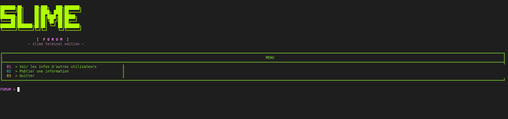

# SLIME FORUM
# 🟢 SLIME FORUM

SLIME FORUM est un forum en ligne fonctionnant directement dans un terminal.

L'objectif est d'avoir une interface simple et originale entièrement utilisable depuis le CMD de Windows ou le terminal de Linux et macOS.

Les utilisateurs des différentes plateformes se connectent au même serveur et peuvent donc consulter les mêmes publications, publier des messages et répondre aux autres utilisateurs.

---

# 💻 Systèmes compatibles

SLIME FORUM possède une version pour :

- 🪟 Windows
- 🐧 Linux
- 🍎 macOS

Toutes les versions utilisent le même principe et communiquent avec le même serveur SLIME FORUM.

---

# ⚙️ Prérequis

SLIME FORUM fonctionne avec Python.

Il est recommandé d'avoir :

- Python 3
- pip
- Une connexion Internet
- Un terminal compatible avec les couleurs ANSI

Le programme utilise également certaines bibliothèques Python qui sont indiquées dans le fichier :

`requirements.txt`

Le lanceur peut créer un environnement Python `.venv` afin de séparer les dépendances de SLIME FORUM du reste des programmes Python installés sur l'ordinateur.

---

# 🐍 Installation de Python

## Windows

Installe Python 3 depuis le site officiel de Python.

Pendant l'installation, active l'option permettant d'ajouter Python au PATH si elle est proposée.

Pour vérifier l'installation, tu peux ouvrir CMD et utiliser :

python --version

ou :

py --version

---

## Linux

Python 3 est déjà présent sur beaucoup de distributions Linux.

Pour vérifier :

python3 --version

Selon la distribution, certains composants supplémentaires comme `python3-venv` peuvent être nécessaires pour créer l'environnement virtuel utilisé par SLIME FORUM.

---

## macOS

Vérifie d'abord si Python 3 est disponible :

python3 --version

Si Python n'est pas installé, installe une version récente de Python 3.

---

# 📦 Installation de SLIME FORUM

Télécharge le projet puis décompresse complètement l'archive.

La structure contient notamment les versions :

SLIME_FORUM/
│
├── WINDOWS/
├── LINUX/
├── MACOS/
└── ...

Chaque système possède son propre lanceur.

---

# 🪟 Lancer SLIME FORUM sur Windows

Ouvre le dossier :

WINDOWS

Puis lance :

SLIME_FORUM_WINDOWS.bat

Le fichier `.bat` prépare l'environnement nécessaire puis lance le client SLIME FORUM.

Une fenêtre CMD apparaît avec l'interface du forum.

Le premier démarrage peut prendre plus de temps, notamment lorsque les dépendances Python doivent être installées.

Les lancements suivants peuvent être plus rapides puisque l'environnement est déjà préparé.

---

# 🐧 Lancer SLIME FORUM sur Linux

Ouvre le dossier :

LINUX

Puis lance :

SLIME_FORUM_LINUX.sh

Le lanceur prépare l'environnement Python et ouvre SLIME FORUM dans le terminal.

L'interface détecte la largeur disponible du terminal afin d'adapter son affichage.

Le lanceur essaie également d'utiliser une grande fenêtre de terminal afin de profiter de l'interface complète de SLIME FORUM.

Selon l'environnement de bureau Linux utilisé, le gestionnaire de fichiers peut proposer une option comme :

- Exécuter
- Lancer
- Exécuter dans un terminal

---

# 🍎 Lancer SLIME FORUM sur macOS

Ouvre le dossier :

MACOS

Puis lance :

SLIME_FORUM_MAC.command

Le Terminal macOS s'ouvre et lance le client.

Lors du premier lancement d'un fichier téléchargé depuis Internet, macOS peut demander une autorisation avant son exécution.

---

# 🟢 Interface

Une fois SLIME FORUM lancé, un grand logo SLIME apparaît directement dans le terminal.

L'interface utilise différentes couleurs afin de différencier les éléments du forum.

Le menu principal ressemble à ceci :

01    >    Voir les publications et réponses

02    >    Publier une information

03    >    Répondre à une publication

04    >    Quitter

Il suffit d'entrer le numéro correspondant à l'action souhaitée.

---

# 👀 01 — Voir les publications

Entre :

01

Cette section récupère les publications présentes sur le serveur SLIME FORUM.

Chaque publication possède notamment :

- un numéro unique ;
- un pseudo ;
- un message ;
- éventuellement des réponses.

Exemple :

#24  Pseudo : Shadow

┌─ INFO ─────────────────────────────
│ Salut tout le monde
│ Premier message sur SLIME FORUM
└────────────────────────────────────

Le numéro `#24` permet notamment d'identifier cette publication lorsqu'un utilisateur souhaite y répondre.

---

# ✍️ 02 — Publier une information

Entre :

02

SLIME FORUM demande d'abord un pseudo.

Exemple :

Pseudo : Shadow

Il est ensuite possible d'écrire le message.

Le système permet d'écrire sur plusieurs lignes.

Entrée permet de créer une nouvelle ligne pendant la rédaction.

Lorsque le message est terminé, la combinaison prévue par l'interface permet de l'envoyer au serveur.

Une fois accepté par le serveur, le message reçoit automatiquement son propre numéro.

Il devient ensuite visible depuis la section :

01 > Voir les publications et réponses

---

# 💬 03 — Répondre à une publication

SLIME FORUM possède également un système de réponses.

Entre :

03

Le programme demande le numéro du message auquel tu souhaites répondre.

Par exemple :

Numéro du message (#) : 24

Le programme retrouve alors la publication `#24`.

Il affiche le message sélectionné puis demande :

- ton pseudo ;
- ta réponse.

La réponse est ensuite associée à la publication correspondante.

Dans la liste des messages, les réponses apparaissent sous leur publication.

Exemple :

#24  Shadow

Salut tout le monde

    ↳ #25 Alex
      Salut Shadow !

        ↳ #26 Ghost
          Bienvenue !

Cela permet de créer de véritables discussions directement depuis le terminal.

---

# 🚪 04 — Quitter

Entre :

04

Le programme ferme proprement SLIME FORUM.

---

# 🌐 Fonctionnement en ligne

SLIME FORUM utilise une architecture client/serveur.

Le principe est :

Windows ───┐
           │
Linux ─────┼────► Serveur SLIME FORUM
           │
macOS ─────┘
                  │
                  ▼
             Publications
             + Réponses

Le programme installé sur l'ordinateur est le client.

Lorsqu'un utilisateur consulte le forum, le client contacte le serveur et récupère les publications.

Lorsqu'un utilisateur publie quelque chose, le client envoie le message au serveur.

Le serveur attribue ensuite un identifiant au message et l'enregistre dans la base utilisée par le forum.

---

# 🔢 Numéro des publications

Chaque publication possède son propre ID.

Par exemple :

#1
#2
#3
#4
#5

Ces numéros permettent au serveur de différencier les publications.

Ils servent également au système de réponses.

Une réponse contient donc une référence vers la publication à laquelle elle appartient.

---

# 👤 Pseudonymes

SLIME FORUM fonctionne avec des pseudonymes.

Lors de la publication d'un message ou d'une réponse, l'utilisateur choisit directement le pseudo qu'il souhaite afficher.

Le pseudo est ensuite affiché avec la publication correspondante.

---

# 🐍 Fonctionnement de Python

Le cœur du client SLIME FORUM est écrit en Python.

Le fichier principal est :

client.py

Il gère notamment :

- l'interface du terminal ;
- le menu ;
- les couleurs ;
- le logo SLIME ;
- la saisie des messages ;
- les publications ;
- les réponses ;
- la communication avec le serveur ;
- l'affichage des discussions.

---

# 📚 requirements.txt

Le fichier :

requirements.txt

contient les bibliothèques Python nécessaires au fonctionnement du programme.

Lors du premier démarrage, le lanceur peut utiliser pip pour installer automatiquement les dépendances nécessaires dans l'environnement Python de SLIME FORUM.

---

# 📁 Environnement `.venv`

Sur Linux et macOS notamment, SLIME FORUM peut créer un dossier :

.venv

Il s'agit d'un environnement virtuel Python.

Il contient une installation isolée des bibliothèques nécessaires au forum.

Cela permet au projet d'utiliser ses propres dépendances sans modifier directement les autres projets Python présents sur l'ordinateur.

---

# 🎨 Interface terminal

L'interface SLIME FORUM est conçue spécialement pour le terminal.

Elle utilise :

- caractères ASCII/Unicode ;
- couleurs ANSI ;
- cadres ;
- texte coloré ;
- logo SLIME ;
- interface adaptée à la largeur du terminal.

Le logo principal est volontairement placé au centre de l'interface tandis que les différentes actions du menu sont présentées clairement avec leurs numéros.

---

# 🔄 Communication avec le serveur

Le client communique avec le serveur via Internet.

Pour récupérer les publications, le client effectue une requête vers l'API du serveur.

Pour publier, il transmet notamment :

- le pseudo ;
- le contenu du message.

Pour une réponse, il transmet également l'identifiant de la publication concernée.

Le serveur traite ensuite la demande et renvoie une réponse au client.

---

# 💾 Stockage des messages

Le serveur utilise une base de données pour enregistrer les publications.

Chaque enregistrement peut notamment contenir :

- ID ;
- pseudo ;
- message ;
- date de création ;
- ID du message parent lorsqu'il s'agit d'une réponse.

Avec une base de données persistante, les publications restent indépendantes du redémarrage du client.

Fermer SLIME FORUM sur son ordinateur ne supprime donc pas les publications présentes dans la base du serveur.

---

# 🌍 Même forum sur tous les systèmes

Les versions Windows, Linux et macOS ne créent pas trois forums différents.

Elles servent uniquement de clients différents pour accéder au même forum.

Par exemple :

Utilisateur Windows
        ↓
   Publication #30
        ↓
Serveur SLIME FORUM
        ↓
Utilisateur Linux

Un message publié depuis Windows peut donc être récupéré depuis Linux ou macOS.

La même chose fonctionne dans l'autre sens.

---

# 📂 Organisation générale

Le projet est organisé autour de plusieurs composants :

WINDOWS/
→ Client et lanceur Windows

LINUX/
→ Client et lanceur Linux

MACOS/
→ Client et lanceur macOS

client.py
→ Programme principal du forum côté utilisateur

requirements.txt
→ Dépendances Python

server.py
→ Partie serveur

Base de données
→ Publications et réponses

---

# 🚀 Premier lancement

Le premier lancement peut être légèrement plus long.

Le programme peut avoir besoin de :

1. détecter Python ;
2. créer `.venv` ;
3. préparer pip ;
4. installer les dépendances ;
5. lancer `client.py` ;
6. contacter le serveur ;
7. afficher SLIME FORUM.

Une fois cette préparation effectuée, les fichiers nécessaires restent présents localement.

---

# 🔌 Connexion Internet

Une connexion Internet est nécessaire pour utiliser les fonctions en ligne du forum.

Le client doit pouvoir communiquer avec le serveur pour :

- récupérer les publications ;
- envoyer une publication ;
- envoyer une réponse ;
- actualiser les discussions.

---

# 🟣 SLIME FORUM

SLIME FORUM transforme simplement le terminal en interface de forum.

Pas besoin d'utiliser une interface web pour discuter : l'expérience principale se déroule directement dans CMD ou dans le terminal.

**Windows • Linux • macOS**

**Python • Terminal • Publications • Réponses • Forum en ligne**
